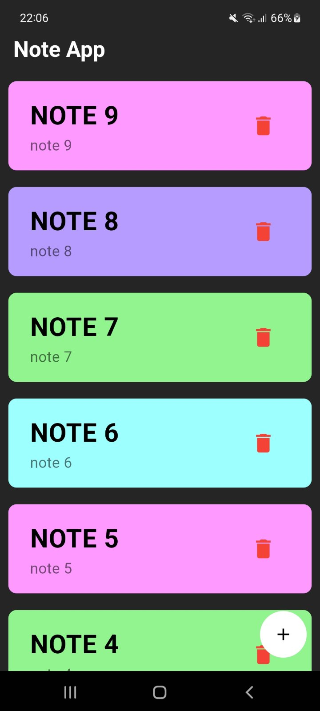
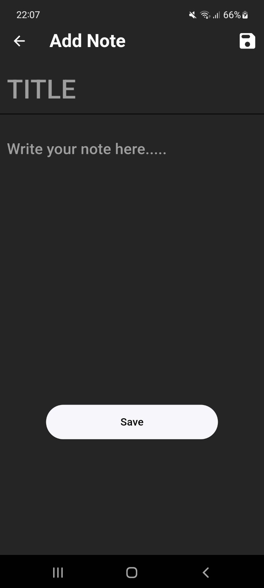
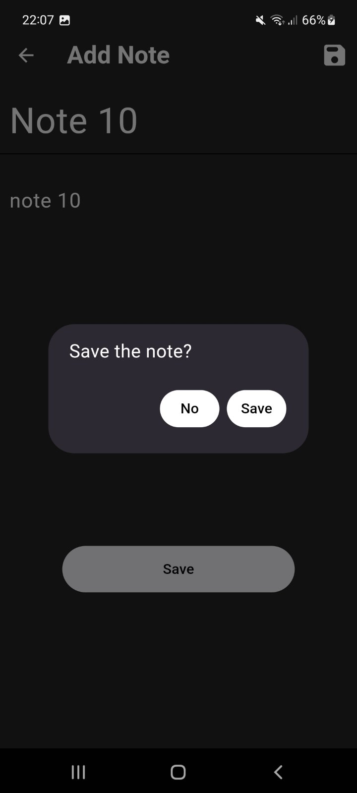
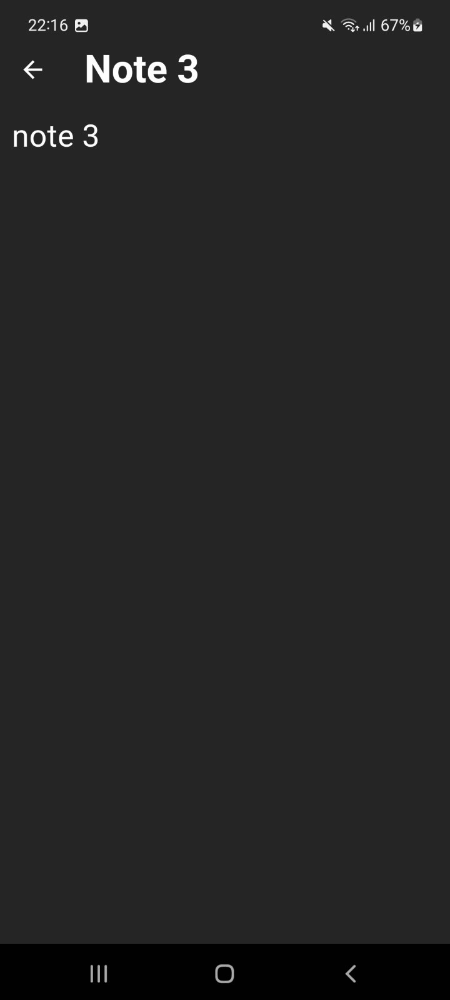

# note_app
A simple app to take notes.

## Features
* Save notes
* Delete notes by a button or swipe-to-delete
* View notes
* The notes are saved in local database
* The Confirmation Dialog shows when the user typed the note but accidentally clicked the back button    

## Screenshots
|           Home Screen            |              Add Note Screen              |
| :------------------------------: | :------------------------------: |
|  |  |

|          Confirmation Dialog          |        Note Screen          |
| :------------------------------: | :------------------------------: |
|  |  |

